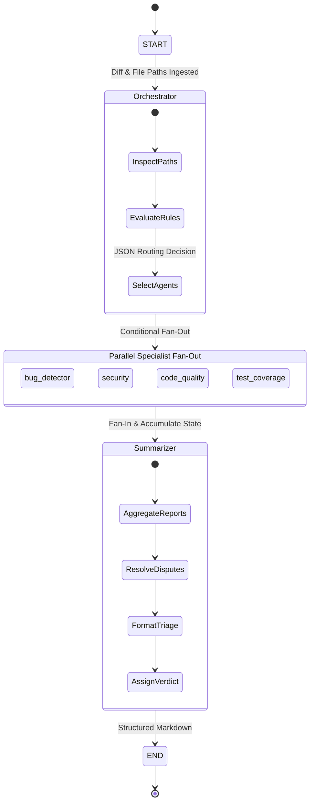

# SendraAI 🛡️⚡
> **Multi-Agent Autonomous Code Review & PR Risk Guardrail**

[](https://www.python.org/downloads/)
[](https://github.com/langchain-ai/langgraph)
[](https://groq.com/)
[-brightgreen.svg)](evals/)
[](LICENSE)

**SendraAI** is an autonomous, multi-agent code analysis pipeline designed to audit Pull Requests with the rigor of a senior engineering review panel. Instead of relying on a single monolithic prompt, SendraAI deploys a team of specialized AI auditors — each dedicated to a single dimension of code health — orchestrated via **LangGraph** and accelerated by ultra-low-latency **Groq LPUs**.

---

## 💡 Why Multi-Agent Specialization?

Single-prompt LLM code reviews routinely suffer from:
1. **Cognitive Overload & Surface-Level Findings**: When asked to simultaneously check for syntax, naming, deep algorithmic bugs, security exploits, and test coverage, single models gravitate toward easy style nits while missing subtle off-by-one errors and injection vectors.
2. **High Hallucination Rates**: Generalized prompts lack deterministic boundary constraints, frequently confusing stylistic opinions with severe correctness bugs.
3. **Flat Severity Triage**: Monolithic outputs often treat an insecure deserialization flaw with the same urgency as a PEP 8 whitespace violation.

### The SendraAI Approach
SendraAI solves this by decomposing code review into focused cognitive roles:
- **Domain Isolation**: Each specialist auditor runs an adversarial, purpose-built system prompt calibrated strictly for its domain.
- **Dynamic Routing**: An intelligent Orchestrator inspects file extensions and diff structure, skipping irrelevant agents (e.g., bypassing security scanning for pure CSS/asset diffs).
- **Arbitration & Synthesis**: A dedicated Lead Synthesizer resolves severity disagreements, merges duplicate findings, and issues an authoritative verdict (`APPROVE`, `REQUEST CHANGES`, or `NEEDS DISCUSSION`).

---

## 🏛️ System Architecture & Workflow

SendraAI implements a parallel fan-out / fan-in topology with LangGraph:

```mermaid
flowchart TD
    A[Git Diff / PR Ingestion] --> B[Diff Preprocessor & Chunker<br/><code>src/chunker.py</code>]
    B --> C[Orchestrator Node<br/><code>src/agents/orchestrator.py</code>]
    
    subgraph Parallel Specialist Auditing
        C -->|Active| D1[🐞 Bug & Logic Hunter<br/><code>bug_detector</code>]
        C -->|Active| D2[🛡️ Security & Exploit Auditor<br/><code>security</code>]
        C -->|Active| D3[📐 Clean Architecture & Style<br/><code>code_quality</code>]
        C -->|Active| D4[🧪 Test Gap & Edge Case Analyst<br/><code>test_coverage</code>]
    end
    
    D1 --> E[Lead Synthesizer & Arbiter<br/><code>src/agents/summarizer.py</code>]
    D2 --> E
    D3 --> E
    D4 --> E
    
    E --> F[Severity Escalation & Conflict Resolution]
    F --> G[Cross-Agent Deduplication]
    G --> H[Token Budget Throttle]
    H --> I[Final Review & Actionable Verdict<br/>APPROVE | REQUEST CHANGES | NEEDS DISCUSSION]
```

### LangGraph State Transition Topology



---

## 🤖 Specialized Auditor Agents

| Agent | Responsibility | Key Detection Vectors |
|---|---|---|
| **🐞 Bug & Logic Hunter**<br/>`bug_detector` | Correctness & Algorithmic Integrity | Off-by-one bounds, null/None dereferences, infinite loops, inverted conditions, variable mutation in loops. |
| **🛡️ Security & Exploits**<br/>`security` | Vulnerability & Exploit Guardrail | SQLi, Command Injection (`shell=True`), Insecure Deserialization (`pickle`), Hardcoded Secrets, IDOR, Auth bypass. |
| **📐 Clean Architecture & Style**<br/>`code_quality` | Readability & Maintainability | SRP violations, cryptic naming, dead code, duplicated logic, anti-patterns, PEP 8 / style non-compliance. |
| **🧪 Test Gap Analyst**<br/>`test_coverage` | Verification & Regression Risk | Untested boundary conditions, missing mock/fixture coverage, unhandled exception branches, regression paths. |
| **⚖️ Lead Synthesizer**<br/>`summarizer` | Triage, Deduplication & Arbiter | Escalates severity conflicts to higher severity, presents refactoring trade-offs, eliminates duplication, produces verdict. |

---

## ⚡ Key Features

- **Blazing Fast Groq LPUs**: Default chat model `openai/gpt-oss-120b` (fallback: `qwen/qwen3.8-27b`) running at ultra-low inference latency with deterministic outputs (`temperature=0.1`).
- **Resilient Fallback Architecture**: Automated fallback routing (`with_fallbacks`) seamlessly catches model rate limits or context errors and cascades to secondary models without pipeline disruption.
- **Dynamic Token Budget Management**:
  - `MAX_DIFF_CHARS` (40,000 chars default) trims large multi-file diffs proportionally per file.
  - `MAX_SECTION_CHARS` (3,500 chars per agent) prevents upstream summarizer token exhaustion under Groq TPM/ITPM quotas.
- **Cross-Platform & Windows Hardened**:
  - Built-in automatic terminal UTF-8 encoding reconfiguration prevents Windows `cp1252` charmap crashes.
  - Automatic SSL certificate authority resolution (`certifi`) and bypass for corporate proxy inspection environments.
- **Battle-Tested Benchmark Suite**: 100% pass rate on rigorous eval benchmarks targeting real-world security vulnerabilities and edge cases.

---

## 🚀 Quickstart Guide

### Prerequisites
- **Python**: Version `3.10` or higher
- **Git**: Installed and on system `PATH`
- **Groq API Key**: Obtain a free key from the [Groq Console](https://console.groq.com/keys)

### 1. Clone & Set Up Virtual Environment

```bash
# Clone the repository
git clone https://github.com/prakhar4651/SendraAI.git
cd SendraAI

# Create and activate virtual environment
python -m venv venv

# On Linux/macOS:
source venv/bin/activate

# On Windows (PowerShell):
.\venv\Scripts\Activate.ps1
```

### 2. Install Dependencies

```bash
pip install -r requirements.txt
pip install -e .
```

### 3. Configure API Credentials

Create a `.env` file in the project root:

```bash
cp .env.example .env
```

Edit `.env` to include your Groq API key:
```env
GROQ_API_KEY=gsk_your_actual_groq_api_key_here
```

---

## 💻 CLI Usage

Once installed with `pip install -e .`, the `sendra` or `sendra-ai` command is globally available across your terminal:

```bash
# Review currently staged git changes (default mode)
sendra
# or
sendra-ai

# Review unstaged changes in working tree
sendra --unstaged

# Review all changes on current branch compared to main
sendra --branch main

# Review a specific commit by SHA
sendra --commit abc1234

# Review a saved patch or diff file and output to Markdown
sendra --file patch.diff --output review.md
```

### Programmatic Python Invocation

You can integrate SendraAI directly into your Python scripts, dev tools, or bots:

```python
from sendra_ai import run_review

diff_text = """
diff --git a/app.py b/app.py
--- a/app.py
+++ b/app.py
@@ -1,3 +1,3 @@
-def query(user):
-    return db.find({"user": user})
+def query(user):
+    return db.execute("SELECT * FROM users WHERE name = '" + user + "'")
"""

review = run_review(code_diff=diff_text, file_paths=["app.py"])
print(review)
```

### Running the Included Sample Diff

SendraAI includes a realistic before-and-after sample diff with intentional bugs and vulnerabilities:

```bash
python src/main.py
```

---

## 🧪 Benchmarking & Evaluations

SendraAI includes an automated keyword-based evaluation runner (`evals/run_eval.py`) that tests the entire pipeline against canonical code diffs:

```bash
python -m evals.run_eval
```

### Benchmark Test Suite

| Case Name | Target Vulnerability / Scenario | Must Mention Keywords | Must NOT Mention | Expected Verdict | Status |
|---|---|---|---|:---:|:---:|
| `sql_injection` | CWE-89: Unsanitized SQL string concatenation | `sql injection`, `parameterized`, `parameterise` | *(None)* | `REQUEST CHANGES` | **PASS (100%)** |
| `hardcoded_secret` | CWE-798: Exposed credentials (`SECRET_KEY`, `DB_PASSWORD`) | `hardcoded`, `secret`, `credential`, `password`, `env` | *(None)* | `REQUEST CHANGES` | **PASS (100%)** |
| `off_by_one` | CWE-193: Slice boundary error causing `IndexError` | `off-by-one`, `out of range`, `bounds`, `indexerror` | *(None)* | `REQUEST CHANGES` | **PASS (100%)** |
| `clean_code_approved` | High-quality, safe `clamp()` utility | `approve`, `clean`, `no issue`, `looks good` | `critical`, `sql injection`, `hardcoded` | `APPROVE` | **PASS (100%)** |

```text
=======================================================
Eval complete: 4/4 cases passed (100% precision)
=======================================================
  [PASS] sql_injection
  [PASS] hardcoded_secret
  [PASS] off_by_one
  [PASS] clean_code_approved
```

---

## 🔄 GitHub Actions CI/CD Integration

Automate code review comments on every Pull Request across your engineering organization:

### 1. Workflow Configuration (`.github/workflows/code_review.yml`)

```yaml
name: SendraAI Code Review

on:
  pull_request:
    types: [opened, synchronize]

jobs:
  review:
    runs-on: ubuntu-latest
    permissions:
      pull-requests: write

    steps:
      - name: Checkout code
        uses: actions/checkout@v4
        with:
          fetch-depth: 0

      - name: Set up Python
        uses: actions/setup-python@v5
        with:
          python-version: "3.11"

      - name: Install dependencies
        run: |
          pip install -r requirements.txt
          pip install -e .

      - name: Generate diff
        run: |
          git diff origin/${{ github.base_ref }}...HEAD > pr.diff
          git diff --name-only origin/${{ github.base_ref }}...HEAD > pr_files.txt

      - name: Run SendraAI
        env:
          GROQ_API_KEY: ${{ secrets.GROQ_API_KEY }}
        run: |
          sendra --file pr.diff --output review.md

      - name: Post review as PR comment
        uses: actions/github-script@v7
        with:
          script: |
            const fs = require('fs');
            const review = fs.readFileSync('review.md', 'utf8');
            const body = `## 🛡️ SendraAI Code Review\n\n${review}\n\n---\n*Automated review by [SendraAI](https://github.com/${{ github.repository }})*`;

            await github.rest.issues.createComment({
              owner: context.repo.owner,
              repo: context.repo.repo,
              issue_number: context.issue.number,
              body,
            });
```

### 2. Configure Repository Secret

1. Go to your GitHub repository → **Settings** → **Secrets and variables** → **Actions**.
2. Click **New repository secret**.
3. Name: `GROQ_API_KEY`.
4. Value: Paste your Groq API Key.

Whenever a pull request is opened or updated, SendraAI will analyze the diff and leave an in-depth, structured review comment.

---

## 📂 Repository Structure

```text
SendraAI/
├── .github/
│   └── workflows/
│       └── code_review.yml     # Automated CI/CD PR review action
├── evals/
│   ├── cases.py                # 4 benchmark test cases with validation rules
│   └── run_eval.py             # Evaluation runner and scoring harness
├── examples/
│   ├── app_before.py           # Pre-diff baseline source
│   ├── app_after.py            # Post-diff modified source
│   └── sample_diff.py          # Unified diff generator for manual testing
├── src/
│   ├── agents/
│   │   ├── bug_detector.py     # Logic error & correctness agent
│   │   ├── code_quality.py     # Readability & clean architecture agent
│   │   ├── orchestrator.py     # File inspector & dynamic graph router
│   │   ├── security.py         # Vulnerability & exploit auditor
│   │   ├── summarizer.py       # Deduplication, conflict resolver & synthesizer
│   │   └── test_coverage.py    # Test gap & edge case analyst
│   ├── chunker.py              # Diff budget allocator & file boundary trimmer
│   ├── cli.py                  # CLI command entry point (git diff / file)
│   ├── config.py               # Groq LLM config, fallbacks & SSL setup
│   ├── graph.py                # LangGraph StateGraph topology definition
│   ├── logger.py               # Synchronized dual-stream logging (file & stdout)
│   ├── main.py                 # Core API & pipeline entry point
│   └── state.py                # ReviewState schema & reducer definitions
├── .env.example                # Sample environment template
├── .gitignore                  # Git hygiene rules
├── pyproject.toml              # Build & package distribution metadata
├── requirements.txt            # Dependency manifest
└── README.md                   # Documentation & guide
```

---

## 📄 License

Distributed under the MIT License. See `LICENSE` for more information.
