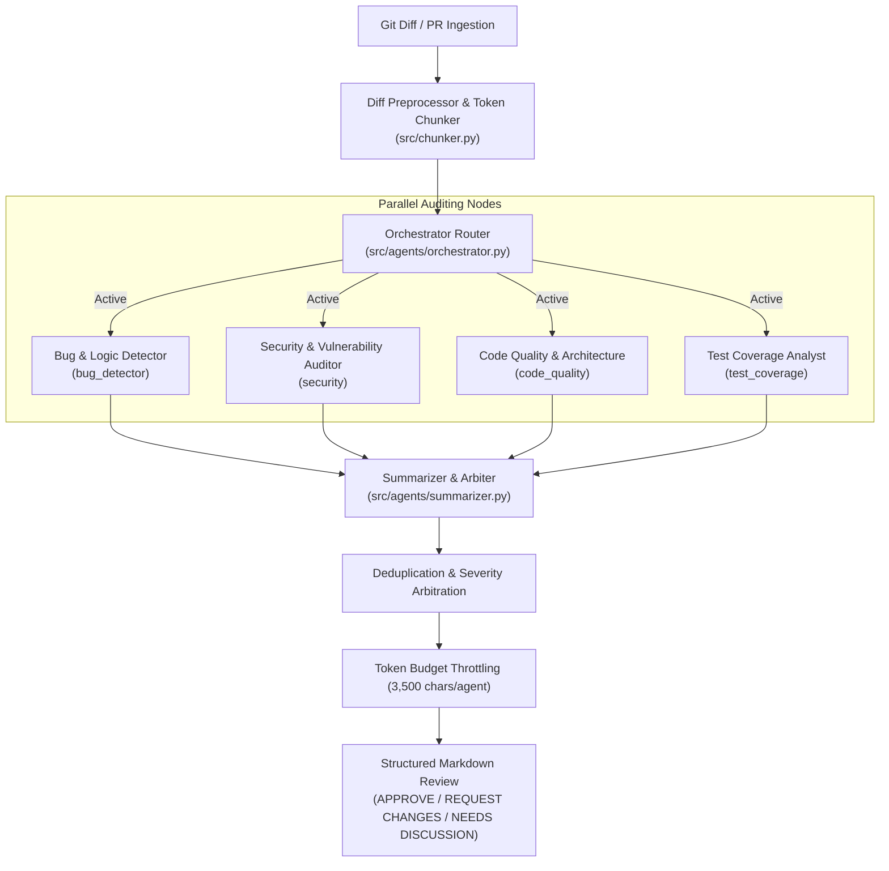
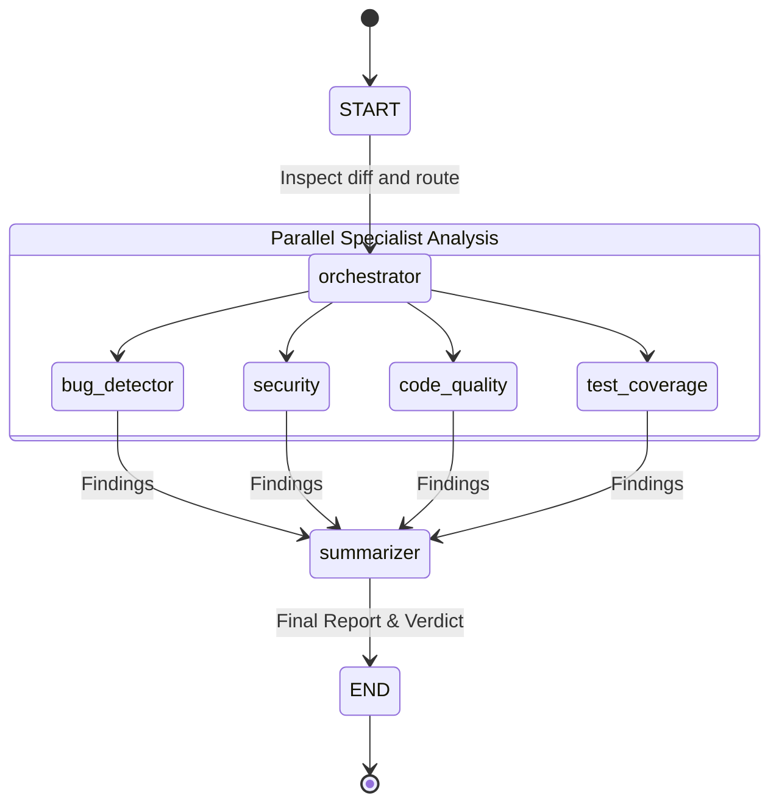

# SendraAI

> Autonomous multi-agent pull request risk review powered by LangGraph and Groq.

[](https://pypi.org/project/sendra-ai/)
[](https://pypi.org/project/sendra-ai/)
[](LICENSE)

SendraAI is a modular multi-agent code analysis engine designed to evaluate Pull Requests with structured, role-specialized auditing. Rather than relying on a single general-purpose prompt, SendraAI dispatches a panel of targeted agents—each calibrated for a single audit domain—orchestrated as a state graph via **LangGraph** and executed with low-latency inference on **Groq LPUs**.

---

## Quickstart

### Installation

Install `sendra-ai` from PyPI:

```bash
pip install sendra-ai
```

### Library Usage

Review unified git diffs programmatically in three lines:

```python
import os
from sendra_ai import run_review

os.environ["GROQ_API_KEY"] = "gsk_..."

diff_text = """--- a/service.py
+++ b/service.py
@@ -12,3 +12,3 @@
-    return db.query(text, id=user_id)
+    return db.query(f"SELECT * FROM users WHERE id = {user_id}")
"""

report = run_review(diff_text)
print(report)
```

You can also compile and customize the underlying LangGraph topology directly:

```python
from sendra_ai import build_graph

graph = build_graph()
# Invoke or stream review state nodes
```

### CLI Usage

Set your Groq API key:

```bash
export GROQ_API_KEY="gsk_..."
```

Run reviews directly against your repository or patch files:

```bash
# Review staged git changes via pipe
git diff --staged | sendra

# Review currently staged git changes (default mode)
sendra

# Review unstaged working tree changes
sendra --unstaged

# Review branch changes compared to main
sendra --branch main

# Review a specific commit
sendra --commit abc1234

# Review a patch file and write output to Markdown
sendra --file changes.patch --output review.md
```

*(Note: `sendra-ai` is also available as an identical CLI command alias).*

---

## Architecture & Execution Flow

SendraAI uses a fan-out / fan-in graph architecture. An intelligent Orchestrator inspects the diff metadata, skips non-applicable audits, and dispatches relevant specialists in parallel before a Lead Synthesizer resolves conflicts and assigns a merge verdict.



### Specialist Agent Responsibilities

- **`bug_detector` (Logic & Correctness):** Identifies off-by-one errors, boundary conditions, unhandled exceptions, infinite loops, and invalid state mutations.
- **`security` (Vulnerability Auditor):** Scans for OWASP Top 10 vulnerabilities, injection vectors (SQLi, command injection), exposed credentials or hardcoded keys, and insecure deserialization.
- **`code_quality` (Architecture & Readability):** Evaluates cyclomatic complexity, dead code, naming conventions, type annotation correctness, and maintainability.
- **`test_coverage` (Verification Gaps):** Analyzes newly introduced branches and flags missing boundary tests, regression risks, or untracked failure paths.
- **`summarizer` (Lead Arbiter):** Merges duplicate observations, escalates disputed severity ratings, applies token budgeting, and outputs an actionable review with a definitive verdict: `APPROVE`, `REQUEST CHANGES`, or `NEEDS DISCUSSION`.

---

## Execution State Machine

The review pipeline is modeled as a compiled state graph using LangGraph:



---

## Configuration & Resilience

SendraAI includes production resilience mechanisms designed for rate-limited and enterprise environments:

- **Primary Inference:** Powered by `openai/gpt-oss-120b` on Groq LPUs (`temperature=0.1`) for high-throughput analysis.
- **Dynamic Fallback:** Automatically cascades to `qwen/qwen3.8-27b` upon rate limits or provider downtime. Includes token clamping (`max_tokens <= 800`) to respect Groq free-tier Output Tokens Per Minute (OTPM) limits.
- **Token Budget Throttling:** The summarizer caps individual agent inputs at `MAX_SECTION_CHARS = 3,500`, preventing HTTP 413 request size errors while preserving the most relevant findings.
- **Cross-Platform Compatibility:** Automatically applies Windows UTF-8 console re-encoding (`sys.stdout.reconfigure(encoding="utf-8")`) and SSL certificate fallback handling (`PYTHONHTTPSVERIFY="0"`, `certifi.where()`).

### Environment Variables

| Variable | Description | Default |
|---|---|---|
| `GROQ_API_KEY` | Groq Cloud API authentication key | *Required* |
| `GROQ_MODEL` | Primary model identifier | `openai/gpt-oss-120b` |
| `GROQ_FALLBACK_MODEL` | Fallback model identifier | `qwen/qwen3.8-27b` |
| `GROQ_TEMPERATURE` | Sampling temperature for deterministic review | `0.1` |

---

## Benchmark & Precision Suite

The repository includes a benchmark evaluation harness (`evals/run_eval.py`) that tests the entire pipeline against canonical pull request scenarios.

| Scenario | Target Defect / Pattern | CWE Reference | Expected Verdict | Status |
|---|---|---|:---:|:---:|
| `sql_injection` | Raw string interpolation in database query | CWE-89 | `REQUEST CHANGES` | **PASS (100%)** |
| `hardcoded_secret` | Exposed secret key and database password | CWE-798 | `REQUEST CHANGES` | **PASS (100%)** |
| `off_by_one` | Slice range index error (`len(items) + 1`) | CWE-193 | `REQUEST CHANGES` | **PASS (100%)** |
| `clean_code_approved` | Safe numeric range clamping implementation | N/A | `APPROVE` | **PASS (100%)** |

Run the test suite locally:

```bash
python -m evals.run_eval
```

---

## GitHub Actions CI/CD Integration

Automate code review comments on incoming Pull Requests with this GitHub Actions workflow (`.github/workflows/code-review.yml`):

```yaml
name: SendraAI Code Review

on:
  pull_request:
    types: [opened, synchronize]

jobs:
  review:
    runs-on: ubuntu-latest
    permissions:
      pull-requests: write

    steps:
      - name: Checkout repository
        uses: actions/checkout@v4
        with:
          fetch-depth: 0

      - name: Set up Python
        uses: actions/setup-python@v5
        with:
          python-version: "3.11"

      - name: Install SendraAI
        run: pip install sendra-ai

      - name: Generate diff
        run: |
          git diff origin/${{ github.base_ref }}...HEAD > pr.diff

      - name: Run SendraAI
        env:
          GROQ_API_KEY: ${{ secrets.GROQ_API_KEY }}
        run: |
          sendra --file pr.diff --output review.md

      - name: Post PR Comment
        uses: actions/github-script@v7
        with:
          script: |
            const fs = require('fs');
            const review = fs.readFileSync('review.md', 'utf8');
            const body = `## SendraAI Code Review\n\n${review}\n\n---\n*Automated review by [SendraAI](https://github.com/${{ github.repository }})*`;

            await github.rest.issues.createComment({
              owner: context.repo.owner,
              repo: context.repo.repo,
              issue_number: context.issue.number,
              body,
            });
```

---

## License

Distributed under the MIT License. See [LICENSE](LICENSE) for details.
